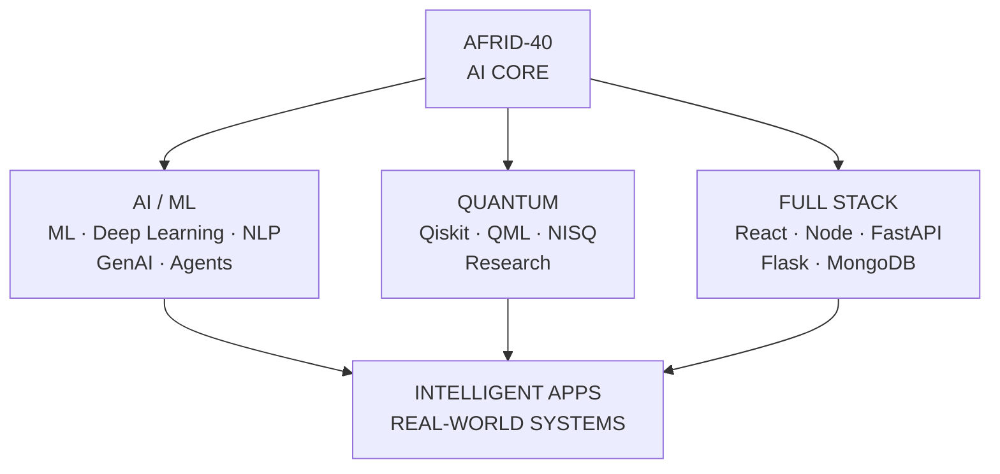

<div align="center">


<br>


</div>

---

# `> WHO_AM_I`

```python
class Afrid:

    identity = "AI/ML Engineer"

    domains = [
        "Artificial Intelligence",
        "Machine Learning",
        "Generative AI",
        "Multi-Agent Systems",
        "Quantum Computing",
        "Full Stack Development"
    ]

    engineering = [
        "Python",
        "JavaScript",
        "React",
        "FastAPI",
        "Flask",
        "MongoDB"
    ]

    mindset = "BUILD > EXPERIMENT > DEPLOY > ITERATE"

    status = "BUILDING INTELLIGENT SYSTEMS"
```

> **I build intelligent systems that turn ideas into working software.**

My work sits at the intersection of **AI/ML, Generative AI, intelligent agents, quantum computing, full-stack engineering, and real-world problem solving**.

I like taking a problem through the complete engineering cycle:

`CONCEPT → ARCHITECTURE → IMPLEMENTATION → TESTING → DEPLOYMENT → ITERATION`

---

# `> SYSTEM_ARCHITECTURE`



### Core Domains

| Domain | Focus |
|---|---|
| 🧠 **AI / ML** | Machine Learning • Deep Learning • NLP • GenAI • Agents |
| ⚛️ **Quantum** | Qiskit • QML • NISQ • Hybrid Quantum-Classical Research |
| ⚙️ **Full Stack** | React • Node • FastAPI • Flask • MongoDB |
| 🚀 **Systems** | Intelligent Applications • Automation • Real-World Solutions |

---

# `> PROJECT_DATABASE`

## `01 // APEX-X`

### 🧠 Multi-Agent AI Executive Assistant

An experimental multi-agent AI system designed to coordinate specialized AI capabilities through an executive orchestration layer.

```text
                         ┌─────────────────────┐
                         │      APEX-X         │
                         │    AI EXECUTIVE     │
                         └──────────┬──────────┘
                                    │
          ┌─────────────┬───────────┼───────────┬─────────────┐
          ▼             ▼           ▼           ▼             ▼
      RESEARCH       PLANNING   COMMUNICATION  PROJECT     LEARNING
          │             │           │           │             │
          └─────────────┴───────────┼───────────┴─────────────┘
                                    ▼
                              MEMORY SYSTEM
```

**Focus:** `AI Agents` `LLM Systems` `Automation` `Memory` `Intelligent Assistants`

**STATUS ::** `ACTIVE DEVELOPMENT`

---

## `02 // QUANTUM SENTIMENT`

### ⚛️ Hybrid Quantum-Classical Sentiment Analysis

A research project exploring a **NISQ-feasible hybrid quantum-classical framework for sentiment analysis**.

```text
DATASET
   │
   ▼
PREPROCESSING
   │
   ▼
FEATURE ENGINEERING
   │
   ▼
┌─────────────────────┐
│    QUANTUM LAYER    │
│                     │
│   Qiskit / QML      │
│   Variational Model │
└──────────┬──────────┘
           │
           ▼
   CLASSICAL MODEL
           │
           ▼
    SENTIMENT OUTPUT
```

**Focus:** `Qiskit` `Quantum ML` `NISQ` `Hybrid AI` `Research`

**STATUS ::** `RESEARCH`

---

## `03 // RESILIENT WEB`

### 🛡️ Disaster Response — Offline-First PWA

A disaster-response application designed for environments where connectivity may be unreliable.

```text
                  USER DEVICE
                       │
                       ▼
              ┌─────────────────┐
              │   OFFLINE PWA   │
              └────────┬────────┘
                       │
          ┌────────────┼────────────┐
          ▼            ▼            ▼
      IndexedDB       SMS       Connectivity
          │
          ▼
      LOCAL DATA
```

**Focus:** `React` `PWA` `IndexedDB` `Leaflet` `Offline Systems`

**STATUS ::** `HACKATHON SYSTEM`

---

## `04 // FAKE NEWS DETECTION`

### 📰 Machine Learning Classification System

A complete NLP classification pipeline for identifying potentially fake news.

```text
RAW DATA
   │
   ▼
CLEANING
   │
   ▼
TF-IDF
   │
   ▼
LOGISTIC REGRESSION
   │
   ▼
PREDICTION API
   │
   ▼
FASTAPI
```

**Focus:** `Python` `Scikit-learn` `TF-IDF` `Logistic Regression` `FastAPI`

**STATUS ::** `DEPLOYABLE ML PROJECT`

---

## `05 // HOLO-LEARN`

### 🎓 AI Virtual Classroom

An experimental learning environment combining AI, interactive education, immersive interfaces, and 3D concepts.

**Focus:** `AI` `Education` `3D` `PWA` `Interactive Systems`

**STATUS ::** `MVP`

---

## `06 // TUBEFILTER-AI`

### 📺 YouTube Spam Detection

A machine-learning classifier designed to detect spam comments.

**Focus:** `Python` `NLP` `Classification` `Flask` `Machine Learning`

**STATUS ::** `COMPLETED`

---

## `07 // PYTHON DSA`

### 📚 Data Structures & Algorithms Lab

A continuously evolving repository for algorithmic problem solving and placement preparation.

```text
ARRAYS
STRINGS
LINKED LISTS
STACKS
QUEUES
TREES
SEARCHING
SORTING
RECURSION
DYNAMIC PROGRAMMING
PROBLEM SOLVING
```

**STATUS ::** `TRAINING`

---

# `> TECH_STACK`

<div align="center">

### PROGRAMMING


<br><br>

### AI / MACHINE LEARNING


<br><br>

### FULL STACK


<br><br>

### DEVELOPMENT TOOLS


<br><br>

### QUANTUM

`QISKIT` • `QUANTUM MACHINE LEARNING` • `VARIATIONAL CIRCUITS` • `NISQ`

</div>

---

# `> CURRENT_OPERATIONS`

```text
╔══════════════════════════════════════════════════════════╗
║                  CURRENT OPERATIONS                      ║
╠══════════════════════════════════════════════════════════╣
║                                                          ║
║  [01] ████████████████████  AI / ML                      ║
║  [02] ██████████████████░░  FULL STACK                   ║
║  [03] █████████████████░░░  PROJECT ENGINEERING          ║
║  [04] ████████████████░░░░  DSA                          ║
║  [05] ███████████████░░░░░  QUANTUM COMPUTING            ║
║  [06] █████████████████░░░  GENERATIVE AI                ║
║                                                          ║
║  SYSTEM STATUS :: BUILDING                               ║
╚══════════════════════════════════════════════════════════╝
```

---

# `> GITHUB_TELEMETRY`

<div align="center">


<br><br>


</div>

---

# `> ACTIVITY_MATRIX`

<div align="center">


</div>

---

# `> MISSION_2026`

```text
╔══════════════════════════════════════════════════════════╗
║                     MISSION 2026                         ║
╠══════════════════════════════════════════════════════════╣
║                                                          ║
║  [✓] Build real-world AI systems                         ║
║  [✓] Explore Quantum Computing                           ║
║  [✓] Build full-stack applications                       ║
║  [>] Master Data Structures & Algorithms                  ║
║  [>] Advance Generative AI                                ║
║  [>] Build production-grade agent systems                 ║
║  [>] Contribute to Open Source                            ║
║  [>] Strengthen engineering portfolio                     ║
║  [>] Prepare for software engineering opportunities       ║
║                                                          ║
║                 MISSION STATUS :: ACTIVE                  ║
╚══════════════════════════════════════════════════════════╝
```

---

# `> ENGINEERING_PHILOSOPHY`

<div align="center">

```text
                         THINK
                           │
                           ▼
                        DESIGN
                           │
                           ▼
                         BUILD
                           │
                           ▼
                      EXPERIMENT
                           │
                           ▼
                        DEPLOY
                           │
                           ▼
                       ITERATE
                           │
                           └──────────────► REPEAT
```

### **"Don't just learn technology. Build with it."**

</div>

---

# `> TERMINAL`

<div align="center">

```text
┌─────────────────────────────────────────────────────┐
│ AFRID-40@AI-CORE:~$                                 │
├─────────────────────────────────────────────────────┤
│                                                     │
│ $ whoami                                            │
│ > AFRID-40                                          │
│                                                     │
│ $ system.status                                     │
│ > AI CORE       : ONLINE                            │
│ > ML ENGINE     : ONLINE                            │
│ > QUANTUM CORE  : ACTIVE                            │
│ > WEB ENGINE    : ONLINE                            │
│ > DSA ENGINE    : TRAINING                          │
│                                                     │
│ $ mission                                           │
│ > BUILD INTELLIGENCE                                │
│ > SOLVE REAL PROBLEMS                               │
│ > SHIP SYSTEMS                                      │
│                                                     │
│ $ future                                            │
│ > LOADING...                                        │
│ > ████████████████████████████████████ 100%         │
│                                                     │
│ $ exit                                              │
│ > ACCESS DENIED                                     │
│ > KEEP BUILDING.                                    │
│                                                     │
└─────────────────────────────────────────────────────┘
```

</div>

---

# `> CONNECT_WITH_ME`

<div align="center">

<a href="https://github.com/Afrid-40">

</a>

<br><br>

<!-- Replace YOUR-LINKEDIN-USERNAME with your actual LinkedIn username -->
<a href="https://www.linkedin.com/in/YOUR-LINKEDIN-USERNAME/">

</a>

<br><br>

```text
╔══════════════════════════════════════════════════════╗
║                                                      ║
║              SYSTEM CONNECTION READY                 ║
║                                                      ║
║        AI  •  ML  •  QUANTUM  •  SOFTWARE            ║
║                                                      ║
║            BUILD INTELLIGENCE. SHIP SYSTEMS.         ║
║                                                      ║
╚══════════════════════════════════════════════════════╝
```

</div>

---

<div align="center">


### `AFRID-40 // AI CORE // END OF TRANSMISSION`

</div>
