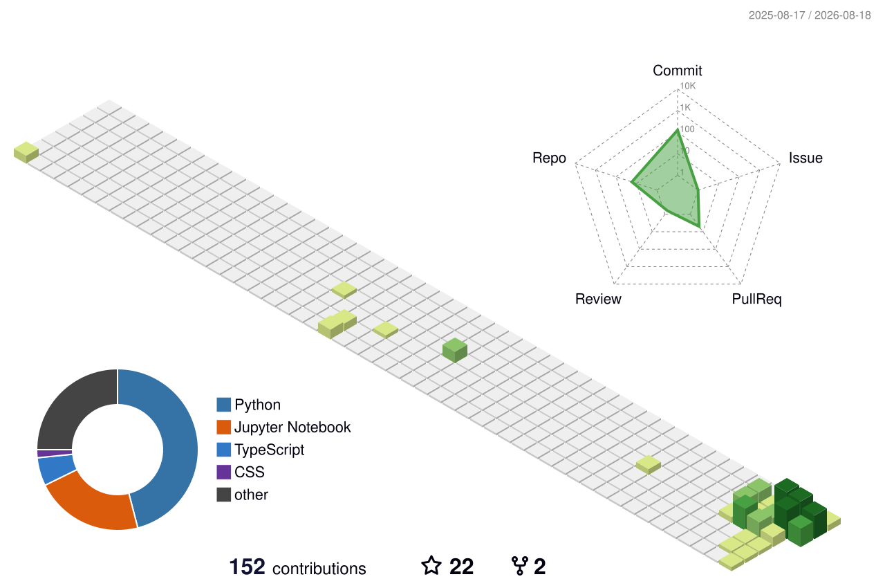

# ⚡ AFRID-40

### AI/ML ENGINEER • GENERATIVE AI • INTELLIGENT SYSTEMS • QUANTUM COMPUTING

**BUILD INTELLIGENCE · SOLVE REAL PROBLEMS · SHIP SYSTEMS**

---

## `> WHO_AM_I`

I build intelligent software at the intersection of **Artificial Intelligence, Machine Learning, Generative AI, intelligent agents, Quantum Computing, and Full-Stack Engineering**.

My engineering cycle:

**CONCEPT → ARCHITECTURE → IMPLEMENTATION → TESTING → DEPLOYMENT → ITERATION**

> **I build intelligent systems that turn ideas into working software.**

---

## `> SYSTEM STATUS`

| SYSTEM | STATUS |
|---|---|
| 🧠 AI / ML | 🟢 ONLINE |
| ✨ Generative AI | 🟢 ACTIVE |
| 🤖 Multi-Agent Systems | 🟡 BUILDING |
| ⚛️ Quantum Computing | 🔵 RESEARCH |
| 🌐 Full-Stack Engineering | 🟢 ONLINE |
| 🧩 DSA | 🟡 TRAINING |

---

## `> 3D CONTRIBUTION MATRIX`

---

## `> CONTRIBUTION SIGNAL`

---

## `> CORE DOMAINS`

| Domain | Focus |
|---|---|
| 🧠 **AI / ML** | Machine Learning • Deep Learning • NLP • Generative AI |
| 🤖 **AI Agents** | Multi-Agent Systems • LLM Applications • Automation |
| ⚛️ **Quantum** | Qiskit • Quantum ML • NISQ • Hybrid Quantum-Classical Research |
| 🌐 **Full Stack** | React • Node.js • FastAPI • Flask • MongoDB • Firebase |
| 🚀 **Systems** | Intelligent Applications • Automation • Real-World Solutions |
| 🧩 **DSA** | Algorithms • Data Structures • Problem Solving |

---

# `> PROJECT DATABASE`

## `01 // APEX-X`

### 🧠 Multi-Agent AI Executive Assistant

An experimental multi-agent AI system designed to coordinate specialized AI capabilities through an executive orchestration layer.

**Focus:** `AI Agents` `LLM Systems` `Automation` `Memory` `Intelligent Assistants`

**STATUS :: ACTIVE DEVELOPMENT**

---

## `02 // QUANTUM SENTIMENT`

### ⚛️ Hybrid Quantum-Classical Sentiment Analysis

A research project exploring a **NISQ-feasible hybrid quantum-classical framework for sentiment analysis**.

**Focus:** `Qiskit` `Quantum ML` `NISQ` `Hybrid AI` `Research`

**STATUS :: RESEARCH**

---

## `03 // RESILIENT WEB`

### 🛡️ Disaster Response — Offline-First PWA

A disaster-response application designed for environments where connectivity may be unreliable.

**Focus:** `React` `PWA` `IndexedDB` `Leaflet` `Offline Systems`

**STATUS :: HACKATHON SYSTEM**

---

## `04 // FAKE NEWS DETECTION`

### 📰 Machine Learning Classification System

A complete NLP classification pipeline for identifying potentially fake news.

**Focus:** `Python` `Scikit-learn` `TF-IDF` `Logistic Regression` `FastAPI`

**STATUS :: DEPLOYABLE ML PROJECT**

---

## `05 // HOLO-LEARN`

### 🎓 AI Virtual Classroom

An experimental learning environment combining AI, interactive education, immersive interfaces, and 3D concepts.

**Focus:** `AI` `Education` `3D` `PWA` `Interactive Systems`

**STATUS :: MVP**

---

## `06 // TUBEFILTER-AI`

### 📺 YouTube Spam Detection

A machine-learning classifier designed to detect spam comments.

**Focus:** `Python` `NLP` `Classification` `Flask` `Machine Learning`

**STATUS :: COMPLETED**

---

## `07 // PYTHON DSA`

### 📚 Data Structures & Algorithms Lab

A continuously evolving repository for algorithmic problem solving and software engineering preparation.

**Focus:** `Arrays` `Strings` `Linked Lists` `Stacks` `Queues` `Trees` `Searching` `Sorting` `Recursion` `Dynamic Programming`

**STATUS :: TRAINING**

---

# `> TECH STACK`

### Programming

`Python` `Java` `C++` `JavaScript` `TypeScript` `HTML` `CSS`

### Artificial Intelligence

`PyTorch` `TensorFlow` `Scikit-learn` `Pandas` `NumPy`

### Generative AI

`LLMs` `AI Agents` `Prompt Engineering` `RAG` `Automation`

### Full Stack

`React` `Node.js` `Express` `FastAPI` `Flask` `MongoDB` `Firebase`

### Development

`Git` `GitHub` `VS Code` `Linux` `Docker` `Postman`

### Quantum Computing

`Qiskit` `Quantum Machine Learning` `Variational Circuits` `NISQ`

---

# `> CURRENT OPERATIONS`

| Operation | Status |
|---|---|
| AI / ML | `████████████████████` |
| Full Stack | `██████████████████░░` |
| Project Engineering | `█████████████████░░░` |
| DSA | `████████████████░░░░` |
| Quantum Computing | `███████████████░░░░░` |
| Generative AI | `█████████████████░░░` |

**SYSTEM STATUS :: BUILDING**

---

# `> ENGINEERING PHILOSOPHY`

**THINK → DESIGN → BUILD → EXPERIMENT → DEPLOY → ITERATE**

> **Don't just learn technology. Build with it.**

---

# `> MISSION 2026`

| Mission | Progress |
|---|---|
| Build real-world AI systems | `████████████████████` |
| Explore Quantum Computing | `██████████████████░░` |
| Build Full-Stack Applications | `██████████████████░░` |
| Master Data Structures & Algorithms | `████████████████░░░░` |
| Advance Generative AI | `████████████████░░░░` |
| Build Production-Grade Agent Systems | `███████████████░░░░░` |
| Contribute to Open Source | `██████████████░░░░░░` |
| Strengthen Engineering Portfolio | `████████████████░░░░` |

**MISSION STATUS :: ACTIVE**

---

# `> TERMINAL`

**AFRID-40@AI-CORE**

`AI CORE : ONLINE`  
`ML ENGINE : ONLINE`  
`QUANTUM CORE : ACTIVE`  
`WEB ENGINE : ONLINE`  
`DSA ENGINE : TRAINING`

**BUILD INTELLIGENCE • SOLVE REAL PROBLEMS • SHIP SYSTEMS**

---

# `> CONNECT WITH ME`

&nbsp;

  

**AI • ML • GENERATIVE AI • AGENTS • QUANTUM • SOFTWARE**

 

**BUILD INTELLIGENCE. SHIP SYSTEMS. KEEP ITERATING.**

---

### `AFRID-40 // NEURAL COMMAND CENTER // ONLINE`

